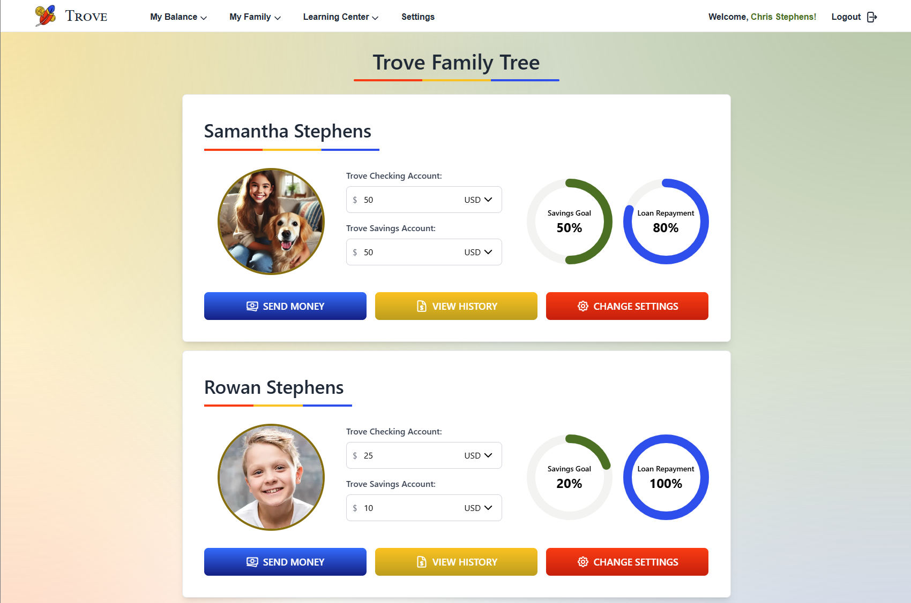
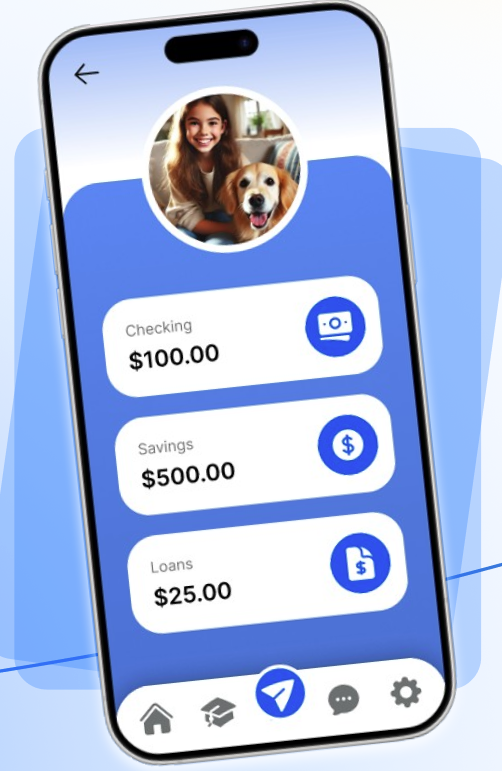

  
  
<strong><em>A financial education app for families of every shape and size</em></strong>

  <a href="https://trove-capstone.vercel.app/"><strong>Visit Trove</strong></a>

## Project Description

Welcome to Trove! Trove is a financial education and children's banking app all rolled into one. It's purpose is to provide a safe environment for parents to teach their kids important lessons on financial literacy. Our team here at Trove recognizes the problems families face today with a lack of access to practical financial education tools and resources, we wanted to do our part to help solve this problem. With Trove, parents can create an account, set up a starting balance, and act as a "bank" for their kids. With our mobile companion app, kids can log in, manage their finances, and take lessons in our Trove Learning Center. Please visit our site at the link above to see what Trove is all about!

Trove was created by a group of students at Atlas School in the City of Tulsa as part of our final capstone project. We had two weeks to complete this project, and we are very proud of what we accomplished! Thank you for visiting Trove!

  

## Table of Contents

- [Usage](#usage)
- [Technologies](#technologies)
- [Features](#features)
- [Roadmap](#roadmap)
- [Contributors](#contributors)
- [License](#license)

## Usage

  
After a parent or guardian creates an account and logs in, they see the Trove Family Tree. Here they can view quick information at a glance to see their children's account balances, view their transaction history, and update their         settings. They can also view their account balance and initiate transfers to their children.

  
  

  
On the mobile companion app, child users can keep track of their account balances, pay off loans, alter their savings goal, and receive notifications from their parents and siblings.

  

## Technologies

## Features

- Create an account with Email or Google OAuth
- Enter a Starting Balance
- Add Children Account Info
- View Trove Family Tree and All Transaction History
- View My Balance and Withholdings Balance Information

## Roadmap

- [ ] Implement Money Sending and Loan Creation
- [ ] Connect With Stripe API for Real Money Usage
- [ ] Implement Custom Settings on a Per User or Per Child Basis
- [ ] Parent Account Editing
- [ ] Upload Profile Images
- [ ] Add Children Accounts After Account Creation
- [ ] Password Reset

  

## Contributors

- Michael Gans - [LinkedIn](https://www.linkedin.com/in/michaellgans/) [GitHub](https://github.com/michaellgans)
- Svitlana Pavlovska - [LinkedIn](https://www.linkedin.com/in/svitlanapavlovska/) [GitHub](https://github.com/SvitLanaPavl)
- Lee West - [LinkedIn](https://www.linkedin.com/in/lee-a-west/) [GitHub](https://github.com/LeeWest89)
- Mei Sibley - [LinkedIn](https://www.linkedin.com/in/mei-sibley/) [GitHub](https://github.com/meisibley)
- Christopher Stephens - [LinkedIn](https://www.linkedin.com/in/c-r-stephens/) [GitHub](https://github.com/Jtownokie)

## License

This project is licensed under a proprietary license. All rights are reserved, and no part of this codebase may be used, modified, or distributed without explicit permission.

  

